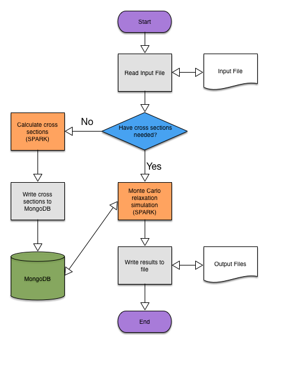

# Scala Monte Carlo Relax
Monte Carlo relaxation simulation using Apache Spark and Scala.
http://arxiv.org/abs/1404.5986

**Current Notes:**

* Universal Scattering implemented
  * Calculated on the fly
* Simple Mars atmosphere implemented
  * H, He, Ar, O, H2, N2, CO, CO2
  * Any of which can be used as either projectiles or targets

**BUGS:**

* run -uni CO CO2 writes a generic file instead of a custom named one with projectile and target names

# to do
* plotter.py
  * add functionality to take multiple files and plot files together on a single plot
  * make plots recognize projectile-target from filename, save figures with descriptive names 
  * add plotter option flag to plot in either a0^2 or cm^2
  
* mc
  * update main code to read cross sections from files, save data structure to memory 

## Usage
### Universal Cross Sections
Writes a file with the format

```
   <Energy[eV]>,<Angle[deg]>,<Amplitude[a0^2]>
```

for a range of energies and angles given the input projectile and target particles.

```
   $ sbt 'run -uni <proj> <targ>'
```
### Universal Total Cross Sections
Writes a file with the format

```
<Energy[eV]>,<TCS[a0^2]>
```

for a range of energies and angles given the input projectile and target particles.

```
   $ sbt 'run -tcs <proj> <targ>'
```
### Universal Average Scattering Angle and Energy Loss
Writes a file with the format

```
<Energy[eV]>,<Ave_Angle[deg]>,<Ave_dE[eV]>
```

for a range of energies and angles given the input projectile and target particles.

```
   $ sbt 'run -ang <proj> <targ>'
```

## Objects and methods


## Program Flow 


## Basic Flow API
_readInputFile_

* number of MC particles to use in simulation

* collision type (Quantum/Universal or Hard Sphere)

* atmosphere density filename
  * csv file with format | altitude (km), temperature (K), targ1Den (1/cm^3), targ2Den (1/cm^3), ... | 
  * example:

```
alt, temp, H, He, C, CO, CO2
100, 270, 1.0e15, 1.4e13, 3.2e11, 4.3e14, 3.1e11
120, 272, 1.0e15, 1.2e13, 2.2e11, 3.9e14, 3.0e11
```

* ENA type
  * needs to be a commonly used string, ("He", "H", "O", "H2O")

* initial ENA position distribution
  * csv file with format | altitude (km), probability (1/km) |
  * sum(probability) * dz = 1
  * example:

```
alt, prob
100, 1.0e-2
120, 1.3e-2
```

* initial ENA energy distribution
  * csv file with format | energy (eV), probability (1/ev) |
  * sum(probability) * dE = 1
  * example:

```
engy, prob
1000, 3.0e-2
1010, 2.3e-2
```

* planet mass
  * in units (kg)
  * used for calculating escape velocity for planet

* planet radius
  * in units (km)
  * used in simulation for spatial atmosphere density

_checkCrossSections_

* determine all scattering pairs
* determine energy ranges needed for cross sections
* query collision database for each collision species
  * for spcies in collision_species
    * if document does not exist
      * call _calculateCrossSections_ for collision pair

_calculateCrossSections_

* determine what type of scattering to do for collision pair
  * quantum partial wave: requires interaction potential(s)
  * universal: works for any collision species with defined masses
  * hard sphere: isotropic hard sphere scatttering


_writeCrossSections_

_runMCSimulation_

_writeResults_
