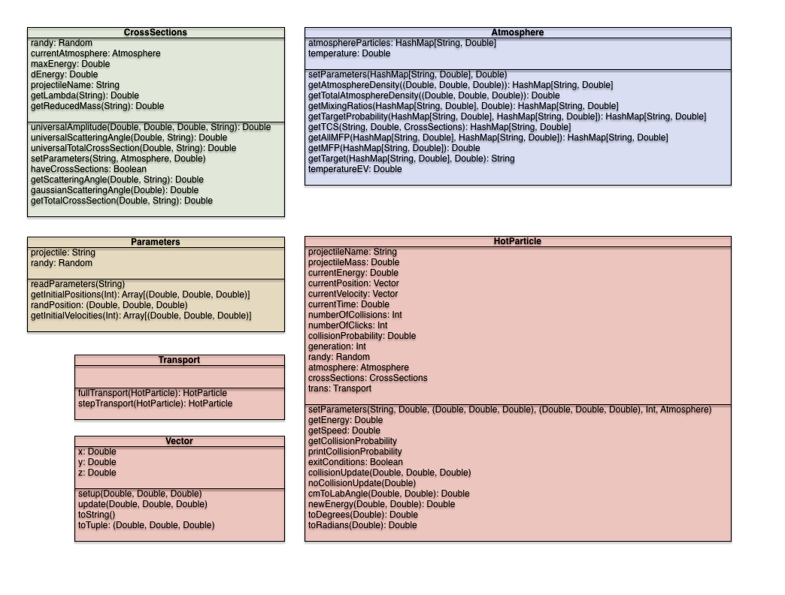

# Scala Monte Carlo Relax
Monte Carlo relaxation simulation using Apache Spark and Scala.
http://arxiv.org/abs/1404.5986

**Current Notes:**

* Universal Scattering implemented
  * Calculated on the fly
* Simple Mars atmosphere implemented
  * H, He, Ar, O, H2, N2, CO, CO2
  * Any of which can be used as either projectiles or targets


## Usage
### Universal Cross Sections
Writes a file with the format

```
   <Energy[eV]>,<Angle[deg]>,<Amplitude[a0^2]>
```

for a range of energies and angles given the input projectile and target particles.

```
   $ sbt 'run -uni <proj> <targ>'
```
### Universal Total Cross Sections
Writes a file with the format

```
<Energy[eV]>,<TCS[a0^2]>
```

for a range of energies and angles given the input projectile and target particles.

```
   $ sbt 'run -tcs <proj> <targ>'
```
### Universal Average Scattering Angle and Energy Loss
Writes a file with the format

```
<Energy[eV]>,<Ave_Angle[deg]>,<Ave_dE[eV]>
```

for a range of energies and angles given the input projectile and target particles.

```
   $ sbt 'run -ang <proj> <targ>'
```

## Objects and methods
